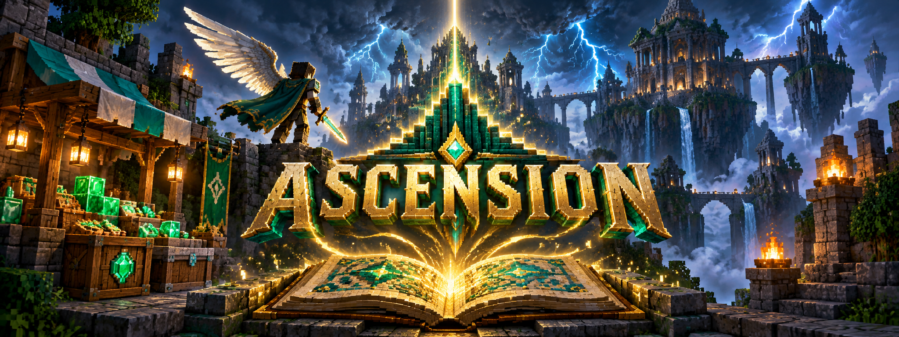

# Ascension 1.5.0

Minecraft progression and trading for Paper: 12 ranks, 30 exclusive titles with three power levels each, assigned hunts, rank renewal, auctions, item currency exchange and a 150-product shop. One title has one server-wide owner; each player can hold up to five and equip one. Title claims require their quests. Elytra starts at 64 emerald blocks; shop restocks take 2–4 hours. Menus and title text use plain text.

Paper 1.21.4 uses Java 21; the separate Paper 26.2 artifact uses Java 25. Java players use inventory menus. iPad/Bedrock players connect through compatible Geyser and server-side Floodgate for forms; without Floodgate, the inventory fallback applies.

Stop and back up the complete server before replacing the correct JAR, then restart. Disable testing.unlock-all-ranks-and-titles in existing production configuration. See [Player guide](PLAYER_GUIDE.md), [Market guide](MARKET_GUIDE.md), [Title levels](TITLE_LEVEL_GUIDE.md), [Complete plugin report](PLUGIN_REPORT.md), [Title verification](TITLE_VERIFICATION.md) and [QA checklist](QA_CHECKLIST.md). The report includes all rank quests, all 90 title power profiles and all 150 shop bundles/prices.

Release verification: 363 tests across 37 suites passed with zero failures, errors or skips. The complete run was followed by a corrected Colossus ownership fixture rerun. Both release builds and the exact-JAR isolated Paper 26 check passed, including 90 title profiles, Java/Bedrock book data, six exchanges and all 150 shop goods. Live two-player/iPad gameplay remains unperformed. See [release record](RELEASE_1.5.0.md).

Copyright (c) 2026 Ayush Anand. Source available under the custom restricted [LICENSE](LICENSE.md); this is not an open-source license. Personal modifications are allowed under those terms. Public redistribution requires the owner's written permission; platform viewing/fork rights remain governed by GitHub's terms.

Build with Java 21 using `./gradlew test jar`. For Paper 26.2, use Java 25 and `./gradlew jar -Ppaper26`.
Download the matching JAR or the complete source archive from the [public repository](https://github.com/novablazebro-cpu/Ascension).

## Downloads

- [Paper 1.21.4 / Java 21 JAR](Ascension-1.5.0.jar)
- [Paper 26.2 / Java 25 JAR](Ascension-1.5.0-paper26.jar)
- [Complete source archive](Ascension-1.5.0-source.zip) — unzip before building; it includes source, tests, Gradle wrapper, resources and documentation.
- [Complete plugin report](PLUGIN_REPORT.md)
- [Verification and hashes](VERIFICATION.json)
